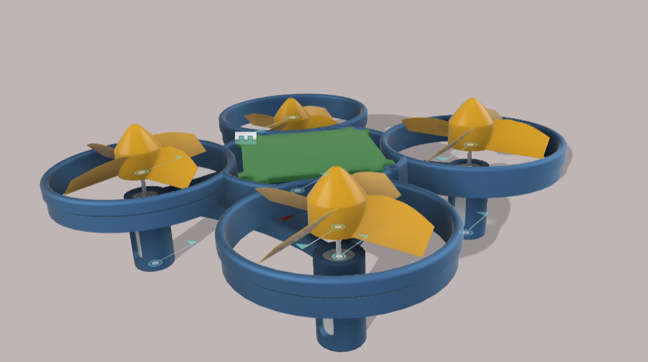
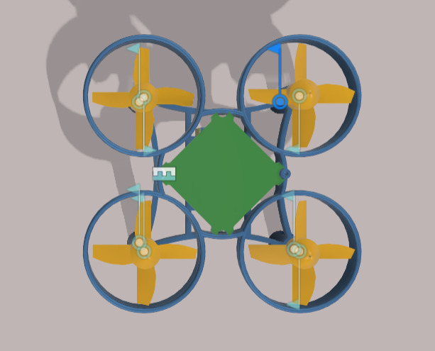
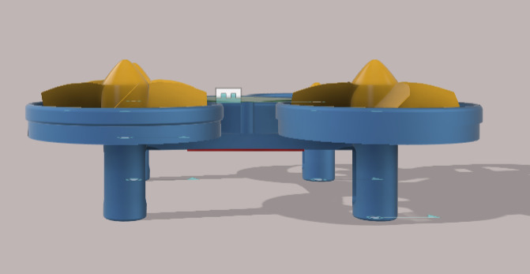
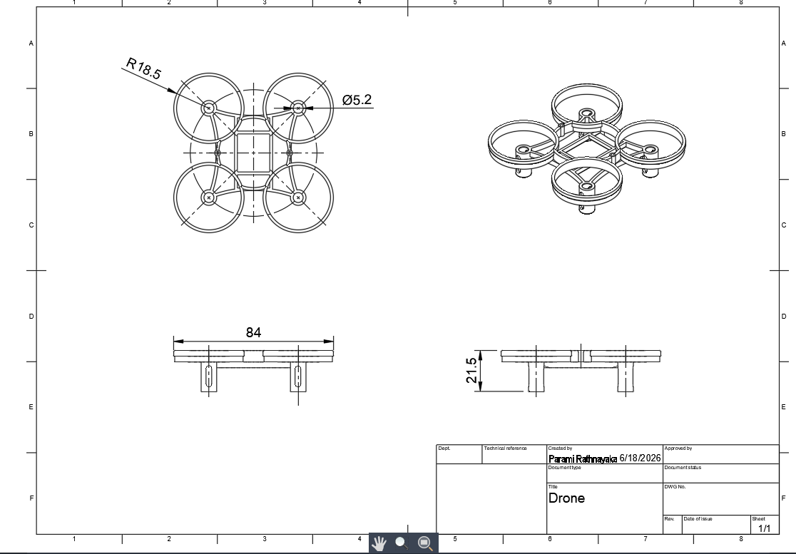

# Quadcopter Simulation Project

## Overview

This project focuses on the CAD design of a micro quadcopter using Fusion 360.

The aim of the project is to explore drone frame design concepts, component placement, and mechanical structure development before moving to electronics integration and flight control implementation.

## Software Used

- Fusion 360

## Completed Work

✔ 3D CAD Model Development

✔ Frame Design

✔ Propeller Guard Design

✔ Component Placement Layout

✔ Engineering Drawing Generation

## Current Status

🟡 Mechanical Design Phase

## Future Development

- Motor Selection
- ESC Selection
- Battery Selection
- Flight Controller Integration
- Electronics Design
- Prototype Fabrication
- Flight Testing

## Design Preview

### Isometric View

### Top View

### Side View

### Technical Drawing

## Project Demonstration

A short demonstration video of the CAD model is included in this repository.

Video: drone_overview.mp4

## Author

Parami Rathnayaka

Electrical and Electronic Engineering Undergraduate
